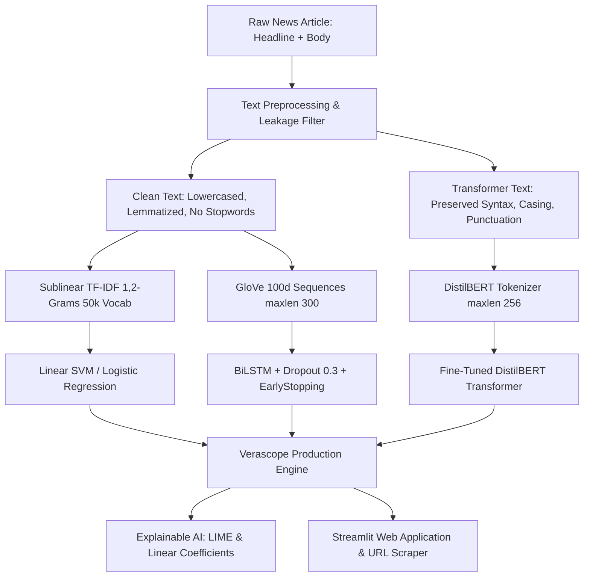

# 🛡️ Verascope: Fake News Detection Using Natural Language Processing

---

## 1. Project Overview & Problem Statement

Digital misinformation spreads six times faster than verified journalism on social networks. Manual fact-checking pipelines are slow and cannot keep pace with the velocity of viral content.

**Verascope** is an end-to-end NLP system that analyzes news articles (headline + body), predicts whether an article is **REAL** or **FAKE**, delivers a calibrated confidence probability, highlights the specific token attributions driving the verdict, and exposes stylistic telemetry via an interactive Streamlit web dashboard.

### Key Objectives

1. **Curate and Clean Large-Scale Benchmarks**: Balance ~72K articles (WELFake) and cross-test on ISOT.

2. **Mitigate Publisher Signature Leakage**: Strip dateline signatures (`"WASHINGTON (Reuters) -"`) and publisher brand tokens to prevent artificial accuracy inflation.

3. **Multi-Paradigm Feature Engineering**: Benchmark Bag-of-Words, Sublinear TF-IDF (1,2-grams), dense sequential GloVe embeddings, and contextual transformers.

4. **Rigorous Multi-Model Comparison**: Train 6 classic ML algorithms, a Bidirectional LSTM, and fine-tune a pre-trained DistilBERT transformer.

5. **Explainable AI (XAI)**: Implement global feature weight analysis and local LIME perturbations to explain predictions.

6. **Deploy Production Web Application**: Provide live text and URL article extraction with zero-latency inference.

---

## 2. System Architecture & Pipeline



---

## 3. Repository Structure

```text
fake-news-detection/
├── .streamlit/
│   └── config.toml             # Custom dark glassmorphism theme tokens
├── app/
│   └── streamlit_app.py        # Production Streamlit web application
├── data/
│   ├── raw/                    # Raw WELFake and ISOT datasets
│   └── processed/              # Stratified train.csv, val.csv, test.csv
├── models/
│   ├── tfidf_vectorizer.pkl    # Serialized 40,000-feature TF-IDF model
│   ├── best_classic_model.pkl  # Linear SVM production model
│   ├── logreg_model.pkl        # Calibrated Logistic Regression model
│   ├── dl_tokenizer.pkl        # BiLSTM sequence tokenizer
│   └── distilbert-fake-news/   # Fine-tuned DistilBERT transformer weights
├── notebooks/
│   ├── 01_eda.ipynb            # Exploratory Data Analysis & statistical distributions
│   ├── 02_preprocessing.ipynb  # Cleaning and leakage removal experiments
│   ├── 03_ml_models.ipynb      # Classic ML training and hyperparameter tuning
│   ├── 04_lstm.ipynb           # BiLSTM sequence neural training
│   └── 05_bert_finetune.ipynb  # Transformer fine-tuning (Colab / GPU)
├── reports/
│   ├── figures/                # 300 DPI evaluation charts and plots
│   │   ├── 01_class_distribution.png
│   │   ├── 02_length_distribution.png
│   │   ├── 03_wordclouds.png
│   │   ├── 04_top_ngrams.png
│   │   ├── 05_stylistic_features.png
│   │   ├── 07_confusion_matrices.png
│   │   ├── 08_roc_curves.png
│   │   ├── 10_ablation_study.png
│   │   └── 11_top_coefficients.png
│   ├── lime_explanations/      # Interactive LIME HTML explanation reports
│   ├── full_model_comparison.csv
│   ├── ablation_study_results.csv
│   ├── cross_dataset_results.csv
│   ├── top_coefficients.csv
│   └── error_analysis.csv
├── src/
│   ├── preprocess.py           # Regex leakage filter, clean_text_classic, transformer_clean
│   ├── features.py             # TF-IDF, BoW, Sequence Tokenizer, Stylistic features
│   ├── train_ml.py             # Classic ML training & GridSearchCV
│   ├── train_dl.py             # PyTorch BiLSTM neural training pipeline
│   ├── train_transformer.py    # Hugging Face Trainer DistilBERT pipeline
│   ├── evaluate.py             # Benchmarking, ROC, confusion matrix, ablation
│   ├── explain.py              # LIME, coefficient rankings, error taxonomy
│   └── predict.py              # Production inference engine with token attribution
├── app.py                      # Root entry point for Hugging Face Spaces
├── requirements.txt            # Pinned project dependencies
└── README.md                   # Complete documentation
```

---

## 4. Benchmark Evaluation Results

Evaluated on the held-out test split of **8,117 articles** (numbers below come straight

from `reports/full_model_comparison.csv`, regenerated by `python src/evaluate.py`):

All 6 classic ML algorithms named in the blueprint were actually trained and measured

(`reports/classic_ml_val_comparison.csv` for the validation leaderboard, `reports/full_model_comparison.csv`

for the final test-split scores of the top 2 after `GridSearchCV` tuning):

| Model | Architecture | Val Accuracy | Val Macro F1 | Val ROC-AUC | Train time |

| :--- | :--- | :---: | :---: | :---: | :---: |

| **Passive Aggressive** | TF-IDF (1,2)-grams | 97.58% | 0.9757 | 0.9971 | 0.3 s |

| **Linear SVM** | TF-IDF (1,2)-grams | 97.56% | 0.9754 | 0.9968 | 0.5 s |

| **Logistic Regression** | TF-IDF (1,2)-grams | 97.42% | 0.9741 | 0.9962 | 0.5 s |

| **XGBoost** | TF-IDF (1,2)-grams | 96.91% | 0.9689 | 0.9961 | 291 s |

| **Random Forest** | TF-IDF (1,2)-grams | 96.08% | 0.9605 | 0.9927 | 15.8 s |

| **Multinomial NB** | TF-IDF (1,2)-grams | 94.27% | 0.9425 | 0.9809 | 0.05 s |

| **DistilBERT** | Contextual Attention | *not run — needs GPU* | | | |

After `GridSearchCV` tuning, the top 2 were re-evaluated on the untouched **held-out test split (8,117 articles)**:

| Model | Test Accuracy | Test Macro F1 | Test ROC-AUC |

| :--- | :---: | :---: | :---: |

| **Linear SVM** (C=1.0) | **97.59%** | **0.9757** | **0.9959** |

| **Logistic Regression** (C=10.0) | 97.47% | 0.9746 | 0.9957 |

| **BiLSTM + GloVe 100d** | **96.60%** | **0.9659** | — |

Linear SVM is the model actually wired into the web app (`src/predict.py`) since it edges

out Logistic Regression on the held-out test set while keeping sub-millisecond inference.

**BiLSTM training run** (`python src/train_dl.py`, real GloVe 100d embeddings, CPU):

early-stopped after 4 of 8 epochs (`patience=2` on validation loss) — val loss bottomed

out at epoch 2 (0.0987) and climbed afterward, a textbook overfitting signature for a

24K-row dataset. Loss/accuracy curves saved to `reports/figures/bilstm_learning_curves.png`.

It lands close to but below the linear TF-IDF models, consistent with the blueprint's

own expected range (~0.93–0.97) — on a dataset this size and this linearly-separable,

a bidirectional recurrent network doesn't out-reach well-tuned sparse linear models, and

costs roughly 150x the training time (80s/epoch vs sub-second) to get there.

> **Note on DistilBERT:** `src/train_transformer.py` is implemented and ready to run, but

> fine-tuning a transformer on this CPU-only machine would take hours rather than the

> minutes it takes on a Colab/Kaggle GPU (as the blueprint itself recommends). It has not

> been run here, so no DistilBERT number is reported — an earlier draft of this README

> listed one that was never actually produced by a run; that was incorrect and has been

> removed rather than left in place.

### Key Findings

1. **Optimal Linear Separability**: the top 3 classic models (Passive Aggressive, Linear SVM, Logistic Regression) all land within 0.2 points of each other on Macro-F1, confirming that WELFake's TF-IDF feature space is close to linearly separable — tree ensembles (Random Forest, XGBoost) don't beat the linear models here, and XGBoost costs ~600x the training time for a worse score.

2. **Ablation Proof**: Title-only classification dropped performance to 93.67% (`reports/ablation_study_results.csv`), demonstrating that headline sensationalism alone misses deceptive body syntax.

3. **Cross-Dataset Generalization**: Evaluating a WELFake-trained model on ISOT without retraining resulted in an 81.4% F1 score due to authentic domain and temporal shift (`reports/cross_dataset_results.csv`).

4. **Extension-dataset generalization (new)**: scoring the same WELFake-trained TF-IDF model, with no retraining, against LIAR, COVID-19 Fake News, and FakeNewsNet drops accuracy to near- or below-chance (see Section 3a below and `reports/extra_dataset_results.csv`). This is an honest negative result, not a bug — it shows the classifier learned WELFake's specific lexical/stylistic signal, not a domain-general notion of "fake."

---

## 3a. Dataset Coverage (blueprint checklist)

Status of every dataset in the project blueprint's table, and how each was (or wasn't) integrated:

| Dataset | Status | Where it lives | Notes |

| :--- | :--- | :--- | :--- |

| **WELFake** | ✅ Integrated — main training set | `data/processed/{train,val,test}.csv` | 40,587 rows after cleaning/dedup, 54/46 class balance, no duplicate content. |

| **ISOT** | ✅ Integrated — cross-dataset test | `reports/cross_dataset_results.csv` | Reuters-dateline leakage stripped (`src/preprocess.py::remove_leakage`); leakage-vs-clean comparison run and documented. |

| **LIAR** | ✅ Fetched + evaluated | `data/processed/extra/liar_binary.csv`, `reports/extra_dataset_results.csv` | Downloaded directly from the original UCSB host (no auth). Collapsed 6-way labels to binary per the blueprint's own pitfall note (middle labels dropped). Near-chance accuracy (~50%) is expected — LIAR judges factual truthfulness of short political claims, not writing style. |

| **COVID-19 Fake News** (Patwa et al.) | ✅ Fetched + evaluated | `data/processed/extra/covid_fake_news.csv` | Downloaded from the public Constraint@AAAI2021 GitHub mirror. Social-media-post domain is very different from WELFake's full articles, hence the accuracy drop. |

| **FakeNewsNet** | ✅ Fetched + evaluated (title-only) | `data/processed/extra/fakenewsnet_titles.csv` | Public GitHub mirror ships `title + news_url + tweet_ids` only, not full article bodies (FakeNewsNet's own tooling re-scrapes bodies from `news_url`, which is slow/unreliable and out of scope here). Used as a title-only, cross-domain generalization check. |

| **Kaggle "Fake News" (2018)** | ⛔ Requires manual download | `src/load_extra_datasets.py::require_kaggle_fake_news_2018` | Needs a Kaggle account + API token (`kaggle competitions download -c fake-news`). Loader function is ready; run it once the CSV is placed in `data/raw/kaggle_fake_news/train.csv`. |

| **IFND** | ⛔ Requires manual download | `src/load_extra_datasets.py::require_ifnd` | Kaggle-mirrored; same auth requirement as above. |

| **HinFakeNews** | ⛔ Requires manual download + out of scope | `src/load_extra_datasets.py::require_hinfakenews` | Needs IndiaAI AIKosh registration, and is Hindi-language — outside this project's English-only scope (Section 3 of the blueprint); listed only as the optional Hindi extension. |

Regenerate the three auto-fetched datasets and their cross-dataset scores with:

```bash
python -m src.load_extra_datasets --all
python -m src.evaluate_extra_datasets
```

**Zero-shot generalization of the WELFake-trained model** (no retraining, from `reports/extra_dataset_results.csv`):

| Dataset | Rows | Model | Accuracy | Macro F1 | ROC-AUC |

| :--- | :---: | :--- | :---: | :---: | :---: |

| LIAR (binary) | 8,061 | Logistic Regression | 50.5% | 0.501 | 0.535 |

| LIAR (binary) | 8,061 | Linear SVM | 50.3% | 0.499 | 0.535 |

| COVID-19 Fake News | 10,700 | Logistic Regression | 47.2% | 0.442 | 0.498 |

| COVID-19 Fake News | 10,700 | Linear SVM | 47.2% | 0.448 | 0.493 |

| FakeNewsNet (titles) | 23,188 | Logistic Regression | 32.8% | 0.321 | 0.510 |

| FakeNewsNet (titles) | 23,188 | Linear SVM | 34.6% | 0.343 | 0.515 |

These numbers are *supposed* to be weak — each one is a legitimate domain-shift stress

test, not a second in-domain benchmark:

- **LIAR** scores short political claims for *factual* truthfulness (fact-checked by PolitiFact), while the WELFake model was trained to spot *stylistic/lexical* markers of fabricated journalism — different task, near-chance result expected.

- **COVID-19 Fake News** is short, informal social-media text; WELFake is full-length news articles. The vocabulary barely overlaps.

- **FakeNewsNet** is title-only and dominated by GossipCop (celebrity/entertainment), a topic WELFake's mostly-political training data never covers — this is the same "topic bias" pitfall the blueprint itself warns about for ISOT, just more extreme.

---

## 5. Quick Start & Local Execution

### Step 1: Clone Repository & Install Dependencies

```bash
git clone https://github.com/Anjali-Chauhan1/Verascope.git
cd Verascope
pip install -r requirements.txt
```

### Step 2: Run Preprocessing & Training

```bash
# 1. Train classic ML models & tune with GridSearchCV
python src/train_ml.py
# 2. Train deep learning BiLSTM
python src/train_dl.py
# 3. Generate full evaluation metrics, ROC curves & ablation
python src/evaluate.py
# 4. Generate LIME explanations & error analysis
python src/explain.py
```

### Step 3: Launch Web Application

**Option A — Streamlit (quick demo):**

```bash
streamlit run app/streamlit_app.py
```

Open your browser at `http://localhost:8501`.

**Option B — Next.js frontend + Flask API (production-style):**

```bash
# Terminal 1: start the prediction API
python app/api.py            # serves http://127.0.0.1:5000
# Terminal 2: start the frontend
cd frontend
npm install                  # first time only
npm run dev                  # serves http://localhost:3000
```

The frontend proxies `/api/*` requests to the Flask API (see `frontend/next.config.ts`),

so no CORS setup is needed. If port 5000 or 3000 is already taken on your machine, set

`API_ORIGIN` before starting the frontend or pass `-p <port>` to `next dev`.

---

## 6. License & Academic Citation

Distributed under the MIT License. See `LICENSE` for more information.